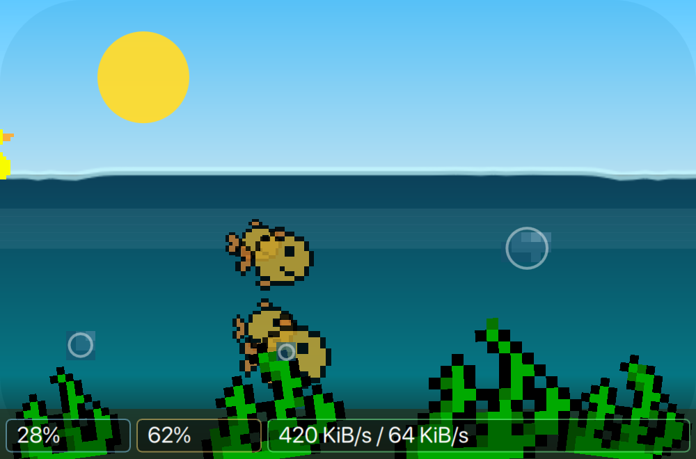
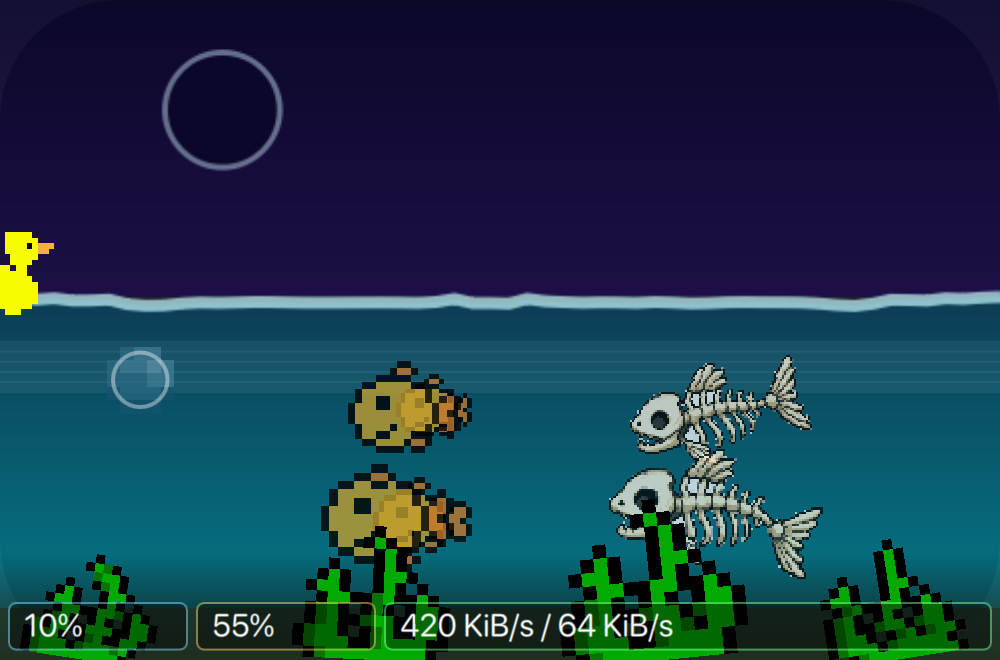
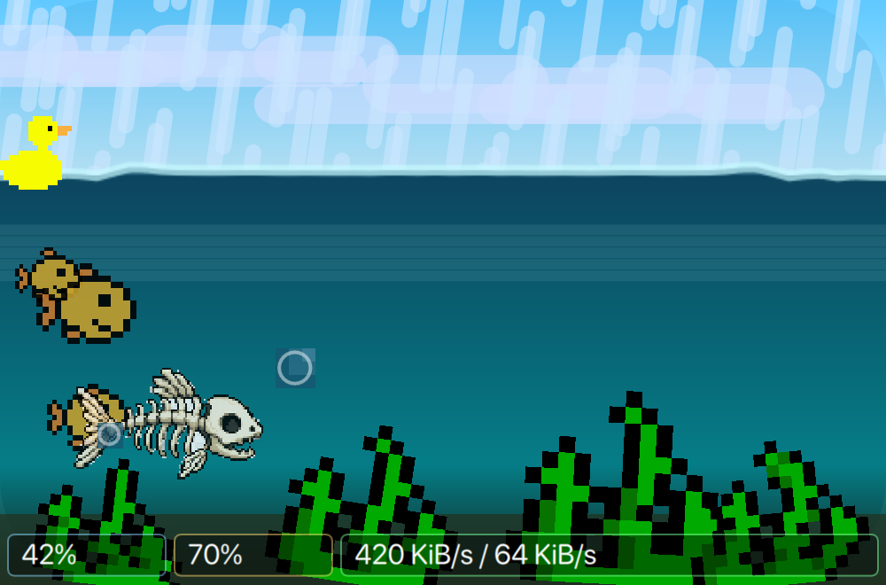
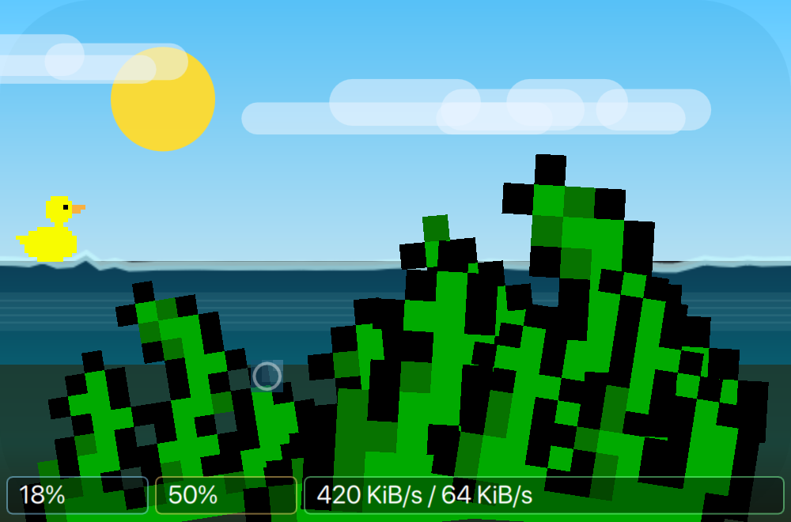
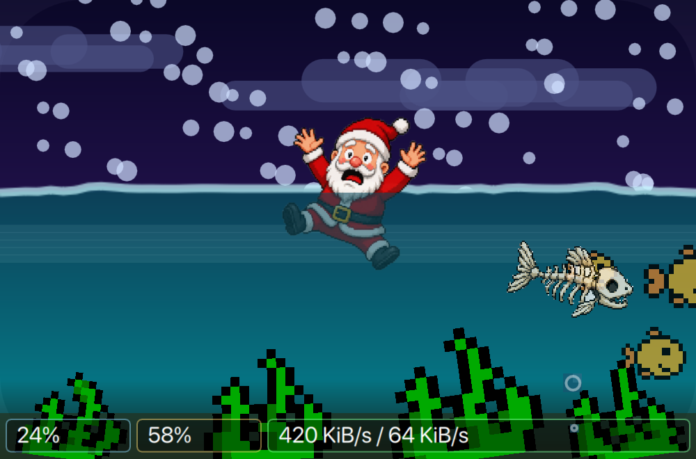
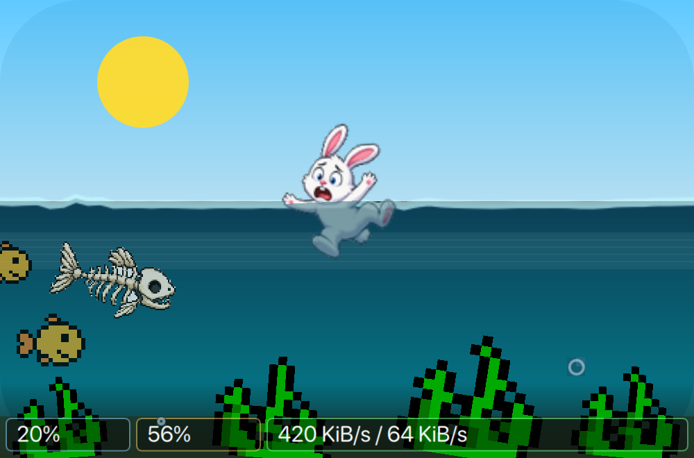
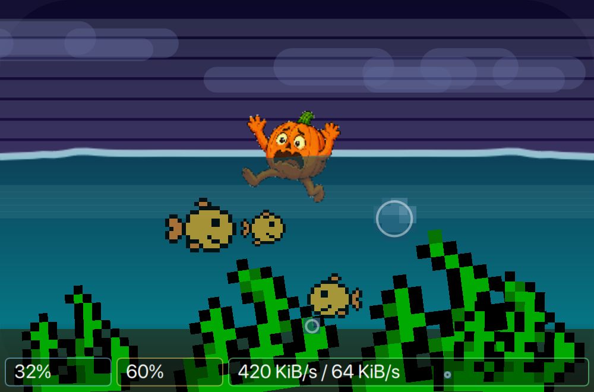
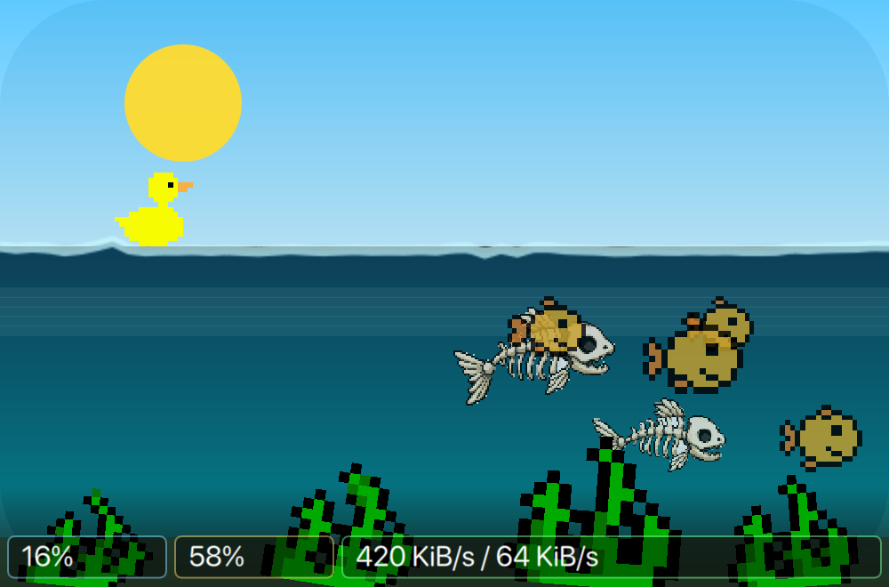
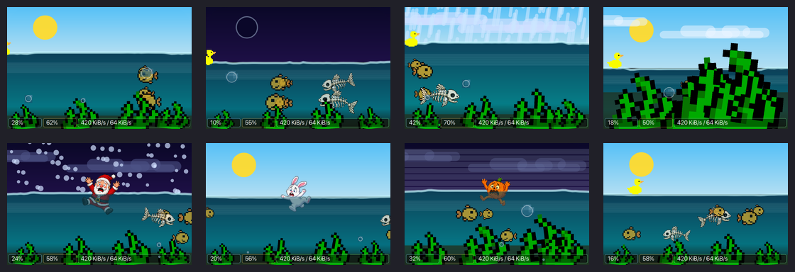

# Super Bubble Fishy Mon

Super Bubble Fishy Mon is a KDE Plasma 6 panel widget inspired by the classic
BubbleFishyMon/gkrellm aquarium monitor. It turns system activity into a tiny
animated aquarium for horizontal and vertical Plasma panels.

Repository: <https://github.com/ebeneezer/sbfm>

Author: Dr. Michael Raus <dr.michael.raus@gmail.com>

## Features

- Square panel representation that follows the panel thickness on horizontal
  and vertical Plasma panels.
- CPU load controls the number of bubbles.
- System load controls the number of fish.
- Network traffic controls fish speed, with smoothing to avoid ugly spikes.
- RAM usage controls the water level.
- Swap usage controls aquatic plant growth.
- When system load drops, surplus fish are removed from the biotope by a
  skeletal predator fish that catches its prey, turns around, and swims away.
- Original BubbleFishyMon fish, bubble, plant, and duck sprites are generated
  from the bundled upstream source assets.
- Bubbles grow while rising and use a light outline for visibility.
- The duck reacts to memory pressure and can capsize when the water level gets
  too low.
- Day/night sky with sun, moon, moon phase rendering, and calculated
  sunrise/sunset times when a location is configured.
- Live weather animation with clouds, rain, snow, fog, and thunderstorm effects.
- Weather location lookup with city/country display and read-only latitude and
  longitude feedback.
- Configurable fallback weather condition when no live weather location is set.
- Seasonal duck replacements for Xmas, Easter, and Halloween.
- Hidden seasonal extra: a rocking cake appears on December 10.
- Click action launches a configurable KDE application.
- Configuration dialog for visibility toggles, frames per second, weather,
  seasonal modes, click actions, and network interface selection.
- WiFish interface selector for choosing the network interface that drives fish
  speed.

## Screenshots



















## Metric Mapping

| System metric | Aquarium element |
| --- | --- |
| CPU load | Bubble count and water disturbance |
| System load | Fish count |
| Selected network interface traffic | Fish speed |
| RAM usage | Water level |
| Swap usage | Plant height |
| Time of day | Sky color, sun, moon |
| Location | Sunrise/sunset calculation |
| Moon phase | Rendered moon shape |
| Weather | Clouds, precipitation, fog, thunder |

## Requirements

- KDE Plasma 6
- Qt 6 / QML
- KSysGuard sensor support
- `kpackagetool6`

The widget uses KSysGuard sensor ids available on Plasma 6, including:

- `cpu/all/usage`
- `memory/physical/usedPercent`
- network download/upload sensors
- load average sensors

## Install Locally

```sh
kpackagetool6 --type Plasma/Applet --install package
```

If an older development copy is already installed:

```sh
kpackagetool6 --type Plasma/Applet --upgrade package
```

Restart Plasma Shell after upgrading during development:

```sh
kquitapp6 plasmashell
kstart plasmashell
```

## Test Window

```sh
plasmawindowed de.drraus.plasma.superbubbyfishymon
```

## Configuration

The configuration dialog provides:

- Application launcher selection for click actions.
- Visibility toggles for water, bubbles, fish, duck, and plants.
- Weather fallback mode.
- Live weather location search and selection.
- Read-only latitude/longitude display for the selected location.
- Season mode: Auto, Xmas, Eastern, Halloween.
- Frames-per-second slider.
- WiFish interface selector.

Clicking the widget opens the configured KDE application, defaulting to
`org.kde.plasma-systemmonitor.desktop`.

## Weather

Super Bubble Fishy Mon can use a configured location for live weather. The
location search accepts city names and coordinates. When multiple city matches
exist, the configuration dialog exposes selectable matches and stores the
resolved city/country label together with coordinates.

If no live weather location is configured, the selected fallback weather
condition is used.

## Seasonal Modes

In `Auto` mode the widget activates seasonal characters by date. The season
dropdown can force Xmas, Eastern, or Halloween mode for testing or permanent
absurdity.

Christmas, Easter, and Halloween characters are rendered with separate
above-water and underwater assets so the waterline remains visually coherent.

## Assets

The classic fish, bubble, plant, and duck sprites are generated from the
original BubbleFishyMon source included under `vendor/bfm/`:

```sh
python3 tools/generate_original_assets.py
```

Additional seasonal PNG assets are bundled in `package/contents/images/`.

## Packaging For Store Distribution

The Plasma package root is `package/`. For store.kde.org or manual sharing,
publish the contents as a Plasma applet package for:

```text
de.drraus.plasma.superbubbyfishymon
```

Useful local checks before publishing:

```sh
qmllint package/contents/ui/*.qml
kpackagetool6 --type Plasma/Applet --upgrade package
plasmawindowed de.drraus.plasma.superbubbyfishymon
```

## License

Super Bubble Fishy Mon is licensed under the GPL-2.0-or-later. See
`LICENSE` and the bundled BubbleFishyMon source license files in
`vendor/bfm/`.
